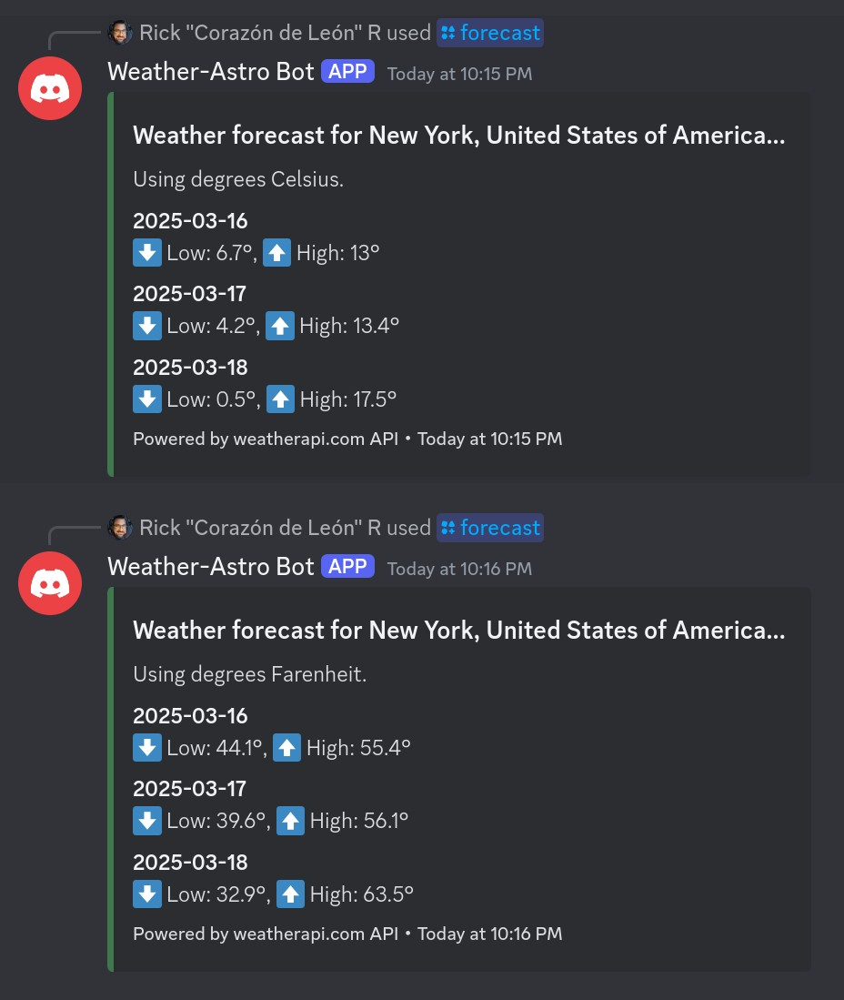

# Weather-Astro Discord Bot
## A Nodejs script that can provide a user weather forecast and astronomical data

### Motivation

Being a fervent user of the discord app on desktop and mobile, I wanted to learn how to create a discord bot and integrate an API with it. I used the openweather API (weatherapi.com) to provide discord users with the weather forecast for a city or zip code along with sun/moon rise and set times.

### Examples

**Using the /forecast command** :partly_sunny:

**Using the /astro command** :sunrise:
